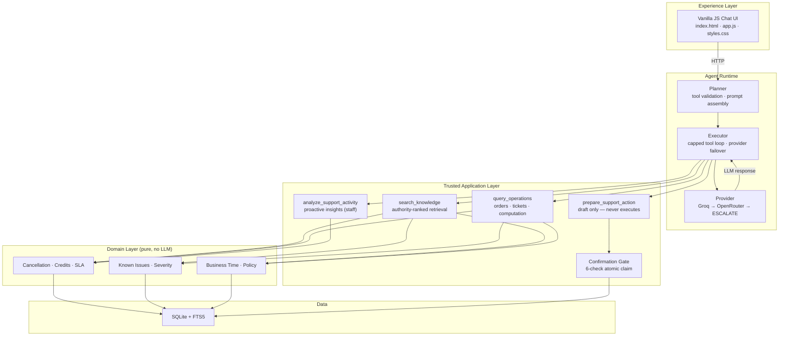

# ParcelPilot — AI Support Agent with Trusted-Layer Authority Resolution

ParcelPilot is a customer-support AI agent built around one specific hard problem: **reasoning correctly over an imperfect source set where not every retrieved document is equally trustworthy.** One policy version is deprecated, two historical ticket resolutions are factually wrong, and customer-specific enterprise agreements override the general SOP. A naive RAG chatbot treats every passage as equally true — ParcelPilot does not.

The model owns tool selection and answer phrasing only. Facts, policy, fees, dates, severity, access decisions and execution all come exclusively from the trusted application layer. If a tool result and the model's wording ever disagree, the tool result wins.

## Key Capabilities

- **Authority-ranked retrieval** — customer-specific agreements override the general SOP; deprecated policy versions are excluded; source provenance is tracked on every claim.
- **Deterministic business logic** — cancellation fees, service credits, SLA breach detection, severity classification and known-issue matching are pure functions with no LLM involvement.
- **Prepare-then-confirm actions** — state-changing operations (escalation, cancellation, credit) are drafted by the agent but never executed until the user explicitly confirms through the UI.
- **Session-scoped authorization** — customer sessions see only their own account; staff sessions see all accounts plus proactive insights. Identity is resolved server-side from the session key, never from request bodies.
- **Provider failover** — Groq (primary) → OpenRouter (fallback) → safe ESCALATE. If both LLM providers are unavailable, the agent degrades gracefully instead of guessing.
- **Framework-free surface** — stdlib `http.server` on the backend, vanilla JS on the frontend. Zero npm or pip build steps beyond three Python dependencies.

## Architecture



See [`docs/01_ARCHITECTURE.md`](docs/01_ARCHITECTURE.md) for the full architecture documentation and ADR log.

## Trust and Source-Authority Model

Every piece of information the agent presents to the user is traced to a source. The evidence resolver applies a strict authority hierarchy:

| Priority | Source | Example |
|----------|--------|---------|
| 1 (highest) | Customer-specific enterprise agreement | Northstar's custom SLA terms |
| 2 | Current support policy | `Support_Policy_v3_CURRENT` |
| 3 | Cancellation/credit SOP | `Cancellation_and_Service_Credit_SOP_v4` |
| 4 | Product operations guide | Known issues, product behavior |
| 5 (lowest) | General support policy | `Support_Policy_v2_DEPRECATED` (excluded) |

**Hard rules:**
- Deprecated policy versions are **never** retrieved, even if they contain relevant keywords.
- If the caller's account has an enterprise agreement, it is **force-included** in every retrieval result.
- When two sources disagree, the higher-authority source wins. The agent sees the resolution, not the conflict.

## Agent and Tool Workflow

The agent runs a capped executor loop (max 6 iterations) with four model-selectable tools:

| Tool | Purpose | Access |
|------|---------|--------|
| `search_knowledge` | Policy/document retrieval with authority ranking | All sessions |
| `query_operations` | Order, ticket, account lookups + deterministic computation | All sessions (account-scoped) |
| `analyze_support_activity` | Proactive analytics (SLA breaches, known-issue matches, clusters) | Staff only |
| `prepare_support_action` | Draft a state-changing action (never executes) | All sessions (account-scoped) |

Each tool call is validated by the planner before dispatch. Invalid parameters, unauthorized access attempts, and malformed requests are rejected before reaching the domain layer.

## Confirmation Workflow

State-changing actions follow a strict prepare → confirm pattern:

1. Agent calls `prepare_support_action` — backend creates a **pending** action with a session-scoped token and 5-minute expiry.
2. UI renders the proposed action with a "Confirm & execute" button and live expiry countdown.
3. User clicks confirm — UI calls `POST /api/actions/confirm`.
4. Backend validates **all six checks** atomically:
   - Action exists
   - Status is `pending` (guarded `WHERE status = 'pending'` claim)
   - Session binding matches
   - Token matches
   - Payload integrity (hash comparison)
   - Not expired
5. Effect runs atomically with the status flip. Double-click, refresh, and replay can never execute the same action twice.

`confirm_support_action` is **not** an LLM-selectable tool — it's a plain backend function the UI calls directly. This ensures the agent can never self-confirm.

## Access Model: Customer vs Staff

| Capability | Customer | Staff |
|-----------|----------|-------|
| View own account orders/tickets | Yes | Yes |
| View other accounts' data | No | Yes |
| Search knowledge base | Yes (own agreement included) | Yes (all sources) |
| Prepare actions | Yes (own account only) | Yes (any account) |
| View proactive insights | No (403) | Yes |
| Analyze support activity | No (403) | Yes |

Identity is resolved server-side from the session key only. Request bodies never carry or alter identity fields.

## Proactive Issue Detection (Staff)

`analyze_support_activity` surfaces deterministically — no ML clustering, the dataset is intentionally small:

- **SLA breaches** — breached and at-risk tickets with breach magnitude
- **Known-issue matches** — pattern matching against the known-issue registry (e.g., KI-208 → TKT-502)
- **Cross-account clusters** — keyword grouping over ticket subjects to detect related incidents

## Provider Failover: Groq → OpenRouter

```
Groq (primary, qwen/qwen3.6-27b)
  │
  ├─ Success → response
  ├─ 429/5xx/timeout/network → try OpenRouter
  └─ 400/401/403/404 → raise (no fallback — application error)

OpenRouter (fallback, openrouter/free router)
  │
  ├─ Success → response (trace marked: provider=openrouter, fallback_used=true)
  └─ Any error → re-raise primary error → safe ESCALATE
```

Fallback triggers only on **provider-level** failures (HTTP 408/429/500/502/503/504, timeout, network error). Application errors (bad requests, auth failures, validation) propagate immediately. See [ADR-008](docs/01_ARCHITECTURE.md#adr-008-openrouter-as-optional-free-tier-fallback-provider).

## Project Structure

```
ParcelPilot/
├── frontend/                 Static UI: index.html + app.js + styles.css
├── backend/
│   ├── api/                  Stdlib HTTP server (routes + static serving)
│   ├── actions/              Confirmation gate (6-check atomic claim)
│   ├── agent/                Planner, executor, provider failover, LLM clients
│   ├── tools/                4 tools (thin interfaces onto domain/)
│   ├── domain/               Pure business rules (no LLM, no framework)
│   ├── trust/                Evidence resolver (force-include + authority rank)
│   ├── security/             Session-scoped authorization
│   └── db/                   schema.sql + seed.py (SQLite + FTS5)
├── tests/
│   ├── layer_a_domain/       Deterministic: no LLM, no network
│   ├── layer_b_tool_use/     Recorded LLM evaluation + offline replay + failover
│   └── layer_c_e2e/          HTTP boundary + 11-check application security gate
├── docs/                     PRD, architecture, domain spec, agent spec, eval spec,
│   └── handoffs/             ADR log, implementation plan, session handoffs
├── .env.example              Environment variable template
├── pytest.ini                Test configuration
├── requirements.txt          Python dependencies (3 packages)
└── README.md
```

## Setup

### Prerequisites

- **Python 3.10+**
- **Groq API key** — free tier at [console.groq.com](https://console.groq.com) (default model: `qwen/qwen3.6-27b`)
- **OpenRouter API key** (optional) — [openrouter.ai](https://openrouter.ai) for free-tier fallback
- **Assessment data pack** — the 6 PDFs and the assessment workbook, placed in `assessment_docs/` (see below)

### Assessment Data Pack

This repository does **not** include the candidate data pack. Place the following files in an `assessment_docs/` directory at the project root:

```
assessment_docs/
├── 01_Support_Policy_v3_CURRENT.pdf
├── 02_Support_Policy_v2_DEPRECATED.pdf
├── 03_Cancellation_and_Service_Credit_SOP_v4.pdf
├── 04_Product_Operations_Guide_and_Known_Issues.pdf
├── 05_Northstar_Logistics_Enterprise_Agreement.pdf
├── 06_LumenWorks_Service_Agreement.pdf
└── ParcelPilot_Assessment_Data.xlsx
```

### Installation

```bash
# Clone
git clone https://github.com/Satvik-19/ParcelPilot.git
cd ParcelPilot

# Create virtual environment
python -m venv .venv
source .venv/bin/activate          # Windows: .venv\Scripts\activate

# Install dependencies
pip install -r requirements.txt

# Configure environment (copy template and fill in your keys)
cp .env.example .env
# Edit .env with your GROQ_API_KEY (required) and OPENROUTER_API_KEY (optional)
```

### Seed the Database

```bash
python -m backend.db.seed
```

This reads the PDFs and workbook from `assessment_docs/`, creates `data/parcel_pilot.db`, and builds the FTS5 document index. Idempotent — safe to rerun.

### Run the Application

```bash
python -m backend.api
```

Opens at **http://127.0.0.1:8000** — serves both the chat UI and the JSON API on one port.

### Environment Variables

| Variable | Required | Default | Description |
|----------|----------|---------|-------------|
| `GROQ_API_KEY` | Yes | — | Groq API key for primary LLM provider |
| `OPENROUTER_API_KEY` | No | — | OpenRouter API key for fallback provider |
| `GROQ_MODEL` | No | `qwen/qwen3.6-27b` | Groq model override |
| `OPENROUTER_MODEL` | No | `openrouter/free` | OpenRouter model override |

## Testing

```bash
# Full deterministic suite (Layer A + B replay + Layer C scripted + security gate)
# No LLM calls, no network — runs in seconds
python -m pytest tests

# Live Layer B/C suites (real LLM calls through Groq → OpenRouter chain)
# Explicitly gated — costs ~100k tokens per run
python -m pytest tests -m live
```

**Current test totals:** 365 deterministic tests across 3 layers, including:
- 32 provider-failover tests (Groq → OpenRouter fallback chain)
- 11-check application security gate
- 12 scripted Layer C cases (full draft → pending → confirm → execute → replay chain)
- 12 golden domain-logic cases
- Layer B offline replay evaluation

## Known Limitations

- **LLM provider free-tier quotas.** Groq provides 200,000 tokens/day on a rolling 24-hour window. OpenRouter's free tier allows 50 requests/day without paid credits (1,000/day with $10+ credits). Both providers unavailable → safe ESCALATE.
- **Mocked session registry.** No real authentication — sessions are selected from a dropdown. This is an assessment demo, not a production auth boundary.
- **No real carrier/payment integrations.** Cancellation requests and service credits are drafted and "executed" as mocked ledger entries, following the same prepare → confirm workflow.
- **No ML clustering** for cross-account incident patterns. The dataset has six PDFs and ~17 data rows; deterministic keyword grouping is the right-sized approach.
- **Framework-free by design.** The application surface uses stdlib `http.server` and vanilla JS. This is an intentional architectural decision ([ADR-007](docs/01_ARCHITECTURE.md#adr-007-framework-free-application-surface--stdlib-http--static-vanilla-js-frontend)), not a missing feature.

## Assessment Demo Coverage

| Area | Coverage |
|------|----------|
| Authority resolution (current vs deprecated policy) | Golden cases GC-01 through GC-12 |
| Enterprise agreement override | Northstar + LumenWorks sessions |
| Cancellation fee computation | Deterministic tests + live agent |
| Service credit eligibility | Deterministic tests + live agent |
| SLA breach detection | Proactive insights view (staff) |
| Known-issue matching | KI-208, KI-211 pattern matching |
| Confirmation workflow | Full prepare → confirm → execute → replay chain |
| Access control | Customer vs staff boundary (11 security checks) |
| Provider resilience | 32 failover tests + live validation |

## License

This project was built for the CalQuity AI Engineer assessment. See [`docs/00_PRD.md`](docs/00_PRD.md) for the product requirements document.
